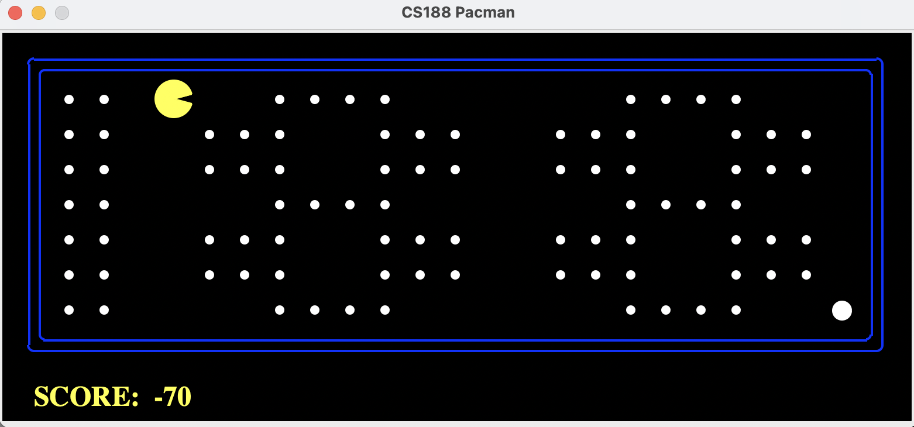

## Q-learning method in Pacman

Run the training command in the directory. i.e. for 2000 runs of training and 10 runs of playing in a small grid, run:

      python pacman.py -p QLearnAgent -x 2000 -n 2010 -l smallGrid

Q-learning enables an agent to learn the optimal policy—mapping states to actions—without needing a model of the environment. It learns from the consequences of actions taken, which makes it powerful for problems where the model dynamics are complex or unknown, like navigating a maze in Pacman.

This implementation performs well on small grids where the state space is limited. However, when there are many ghosts and food objects in the state variable, the state space explosion makes this algorithm prone to local optima and diminishing returns against complexity. 

To combat this, I have implemented a bias that encourages Pac-Man to explore new states, but progress is slow on smallClassic and mediumClassic, and further work is needed to make this exploration function sample efficient. 

I have not used any 'reward shaping' to nudge the algorithm in the early phases, as it seems strong by game 1000. But by game 500, there are still gaps in the permutation tree that can lead to strange behaviour at inference, which would be prevented with more direct design choices. By game 800, these qwerks seem to be ironed out. 

There is room for using a game-scale reward function, which could make the algorithm less short-termist and better capable of discounting several moves ahead. A good acid test for strong performance in this area would be a strong performance on openClassic in few training runs, without the ghost (python3 pacman.py -p QLearnAgent -x 1000 -n 1010 -l openClassic -k 0). As it stands, Pac-Man can perform well only for the first selection of turns, before essentially becoming stochastic. Limiting the radius of sight may improve its ability to generalise and efficiently explore. 

### Structure

#### Implementation of Q-learning

The Q-learning algorithm is implemented in the Pacman game through the following steps:

1. **Initialize Q(s,a):** Set up an initial value for each state-action pair.
2. **Take a Random Action:** Choose an action randomly to explore the environment.
3. **Update Q(s,a):** Apply the Q-learning formula to update the value based on the observed reward and the maximum future reward.
4. **Choose an Action:** Decide on the next action based on the ε-greedy strategy, which balances exploration and exploitation.
5. **Repeat Steps 3 and 4:** Continue this process for each step within an episode.
6. **Final Update:** At the end of each game, update Q(s,a) for the terminal state.

To facilitate these steps, the following attributes are added to the QLearnAgent class:

- A dictionary for storing Q(s,a) values.
- A list to record the last state visited.
- A list to record the last action taken.
- A variable to store the score before the last action.

The Q(s,a) values are stored using a Counter data structure from `util.py`, which simplifies the process of updating and retrieving Q-values. The `argMax()` function from the same utility is used to choose the action that maximizes Q-value for a given state, aligning with the exploitation part of the ε-greedy strategy.

**getAction():**

This function encapsulates the decision-making process at each step:

- Observe the immediate reward from the current state.
- Update the Q-value for the previous state-action pair.
- Use the ε-greedy strategy to choose the next action.
- Update the agent's internal state to reflect the chosen action.
- Return the chosen action to be executed in the game.

**final():**

Called at the end of each game to perform final updates:

- Observe the final reward.
- Update Q(s,a) for the last action taken.
- Reset the agent's internal state in preparation for the next game.

This streamlined implementation ensures that the QLearnAgent continuously learns from its environment, improving its policy over time through a systematic approach to exploration and exploitation.

### Functions:

The structure of agent class is given: 

#### init() 
This is the constructor for QLearnAgent. It is called by the game when the game starts up (because the game starts up the learner).

The version of init() in QLearnAgent allows you to pass parameters from the command
line. Some of these you know from the lectures:
• alpha, the learning rate
• gamma, the discount rate
• epsilon, the exploration rate
and you will use them in the implementation of your reinforcement learning algorithm. The
other:
• numTraining
allows you to run some games as training episodes and some as real games.

All the constructor does is take these values from the command line, if you pass them, and write them into sensibly named variables. If you don’t pass values from the command line, they take the default values you see in the code. These values work perfectly well, but if you want to play with different values, then you can do that like this:

    python3 pacman.py -p QLearnAgent -l smallGrid -a numTraining=2 -a alpha=0.2

Note that you need to have no space between parameter and value alpha=0.2, and you need a separate -a for each one.

#### Function getAction() 
Executes while the agent needs to take an action (every step of the game)

This is the core of code that controls Pacman. It has access to information about the position of Pacman, the position of ghosts, the location of food, and the score. 
The code shows how to access all of these, and if you run the code (as above) all these values are printed out each time getAction() is called.
The only bit that maybe needs some explanation is the food. Food is represented by a grid of letters, one for each square in the game grid. 
If the letter is F, there is no food in that square. 
If the letter is T, then there is food in that square. (Walls are not represented).
The main job of getAction() is to decide what move Pacman should make, so it has to return an action. 
The current code shows how to do that but just makes the choice randomly.

#### Function final() 
Called at the end of every game.

Right now all this function does is to keep track of the number of episodes (more on what they are below) and sets epsilon and alpha to zero when a certain number have happened (more on that in a minute also).

#### hashState()
The purpose of hashState is to transform the game state, which can be a complex and non-hashable object (due to mutable types like lists or custom objects), into a hashable format that can be used as keys in a dictionary. This allows efficient lookup, storage, and updating of Q-values for state-action pairs. 

### Accessibility:

When running using the above query, the only statements printed will be status on each game:

    Game X ✔ [score]
    Game X+1 ✔ [score]

To view all print statements, set in __init__():

    self.enable_print = True
